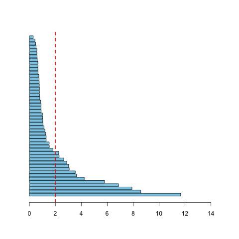
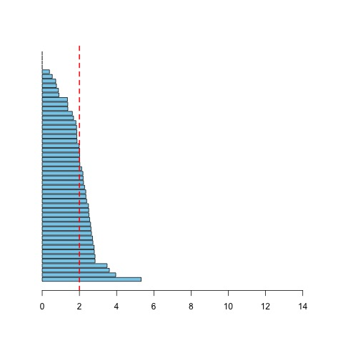

# Risk Analysis of Passive Portfolio

## Sourish Das

### **Abstract**

In this work, we present an alternative passive investment strategy. The passive investment philosophy comes from the Efficient Market Hypothesis (EMH), and its adoption is widespread. If EMH is true, one cannot outperform market by actively managing their portfolio for a long time. Also, it requires little to no intervention. People can buy an exchange-traded fund (ETF) with a long-term perspective. As the economy grows over time, one expects the ETF to grow. For example, in India, one can invest in NETF (see,\cite{NETF}), which suppose to mimic the Nifty50 return. However, the weights of the Nifty 50 index are based on market capitalisation. These weights are not necessarily optimal for the investor. In this work, we present that volatility risk and extreme risk measures of the Nifty50 portfolio are uniformly larger than Markowitz's optimal portfolio. However, common people can't create an optimised portfolio. So we proposed an alternative passive investment strategy of an equal-weight portfolio. We show that if one pushes the maximum weight of the portfolio towards equal weight, the idiosyncratic risk of the portfolio would be minimal. The empirical evidence indicates that the risk profile of an equal-weight portfolio is similar to that of Markowitz's optimal portfolio. Hence instead of buying Nifty50 ETFs, one should equally invest in the stocks of Nifty50 to achieve a uniformly better risk profile than the Nifty 50 ETF portfolio. We also presengt an analysis about how portfolios perform to idiosyncratic events like Russian invasion of Ukraine. We found that the equal weight portfolio has uniformly lower risk that Nifty 50 portfolio, before and during the Russia-Uknraine war.

## R-Code:

### Download data from Yahoo

Download Nifty 50 from Yahoo using the `quantmod` package in `R`, and plot the closing value of Nifty 50 and the log-return.

```R
rm(list=ls())
library(quantmod)
library(tseries)

getSymbols("^NSEI",src = "yahoo")
Nifty50 = NSEI$NSEI.Adjusted
plot(Nifty50)

### log-return
log_return = diff(log(Nifty50))*100
n = length(log_return)

plot(log_return)
```

<p align = "center">


</p>


### Check for Efficient Market Hypothesis with Nifty 50

Step 1: Check if values of Nifty 50 is non-stationary
```R
> library(tseries)
> adf.test(na.omit(Nifty50))
data:  na.omit(Nifty50)
Dickey-Fuller = -2.1463, Lag order = 15, p-value = 0.5164
alternative hypothesis: stationary
```
**Inference**: Fail to reject null hypothesis. That is Nifty 50 values are non-stationary random-walk process.

Step 2: Check if log-returns are non-stationary with Dickey-Fuller test

```R

> adf.test(na.omit(log_return))

data:  na.omit(log_return)
Dickey-Fuller = -14.327, Lag order = 15, p-value = 0.01
alternative hypothesis: stationary
```

**Inference**: We reject the null hypothesis. That is log-returns of Nifty 50 are stationary.

Step 3: Check if the log-returns are uncorrelated with Ljung-Box test.

```R
> Box.test(log_return,lag=10,type = "Ljung-Box")
data:  log_return
X-squared = 37.234, df = 10, p-value = 5.155e-05
```

**Inference**: We reject null hypothesis as p-value is significantly small. That is log-returns of Nifty 50 are correlated.


Step 4: Check if the log-returns are Normal with Shapiro-Wilk test for normality, (see \cite{shapiro_wil_test}).

```R
## Shapiro-Wilk test for normality
## Null Hypothesis: log-return follows Normal distribution
## Alternative Hypothesis : log-return does not 
##                          follow a normal distribution
> shapiro.test(as.vector(log_return))
data:  as.vector(log_return)
W = 0.89425, p-value < 2.2e-16
```  
**Inference**: We reject null hypothesis as p-value is significantly small. That is log-return of Nifty 50 does not follow Gaussian distribution.


## Portfolio Risk Analysis

### Download Nifty50 stocks

```R
nifty50_wt = read.csv('ind_nifty50list_weightage.csv',sep='\t')
colnames(nifty50_wt)[3]<-'Symbol'
nifty50_wt$Symbol = trimws(nifty50_wt$Symbol)
nifty50_wt = nifty50_wt[with(nifty50_wt, order(Symbol)), ]

### download stock data
symbol = nifty50_wt$Symbol
symbol_call = paste0(symbol,'.NS')
df = get.hist.quote(symbol_call[1],start='2019-01-01'
                    ,quote = 'Adjusted')
colnames(df)=symbol[1]

data = df


for( i in 2:length(symbol)){
  df = get.hist.quote(symbol_call[i],start='2019-01-01'
                      ,quote = 'Adjusted')
  colnames(df)=symbol[i]
  data = merge(data,df)
  cat(i,' = ',symbol[i],'\n')
}

df = xts(data)
```

### Consider the dataset between `2021-08/2022-08` and weekly prices


```R
data = df['2021-08/2022-08']
ep1 <- endpoints(data,on="weeks",k=2)
data_wkly = data[ep1]
```

### Split the data between before the Russian invasion of Ukraine and during the war

```R
data_b4_war = data_wkly['/2022-02-20']
data_during_war = data_wkly['2022-02-20/']
```


### Calculate log-return

```R
rt_b4_war=data_b4_war
n=nrow(data_b4_war)
P=ncol(data_b4_war)
for(j in 1:P){
  rt_b4_war[,j]=diff(log(data_b4_war[,j]))*100
}
rt_b4_war= na.omit(rt_b4_war)
dim(rt_b4_war)

[1] 13 50


rt_during_war = data_during_war
n=nrow(data_during_war)
P=ncol(data_during_war)
for(j in 1:P){
  rt_during_war[,j]=diff(log(data_during_war[,j]))*100
}
rt_during_war= na.omit(rt_during_war)
dim(rt_during_war)

[1] 14 50

```

### Calculate sample covariance matrix

```R
## sample covariance
S_b4_war = cov(rt_b4_war)
S_dur_war =cov(rt_during_war)
```


### Portfolio with Nifty 50 weights

```R
nifty50_wt$WEIGHTAGE=trimws(nifty50_wt$WEIGHTAGE)

nifty50_wt$WEIGHTAGE = as.numeric(nifty50_wt$WEIGHTAGE)
nifty50_wt$WEIGHTAGE = (nifty50_wt$WEIGHTAGE/sum(nifty50_wt$WEIGHTAGE))
weight=nifty50_wt$WEIGHTAGE
names(weight)=nifty50_wt$Symbol
```

## Markowitz's Optimised portfolio

```R
## optim portfolio
## calculate regularised covariance
n=dim(rt_b4_war)[1]
P=dim(rt_b4_war)[2]
c=0.01
n0 = (P-n)+c
q=(n0+P+1)/(n0+n+P)
lambda=mean(diag(S_b4_war))
Cov_prior=diag(P)*lambda
reg_cov_b4_war = q*Cov_prior+(1-q)*S_b4_war

n=dim(rt_during_war)[1]
P=dim(rt_during_war)[2]
c=0.01
n0 = (P-n)+c
q=(n0+P+1)/(n0+n+P)
lambda=mean(diag(S_dur_war))
Cov_prior=diag(P)*lambda
reg_cov_dur_war = q*Cov_prior+(1-q)*S_dur_war

## Portfolio Optimisation using b4 war data only
b4_war_opt_weight = portfolio.optim(rt_b4_war,covmat=reg_cov_b4_war,shorts=F)$pw

## add naes to the optimised weights
names(b4_war_opt_weight)=rownames(reg_cov_b4_war)

## Draw barplots of weights
barplot(sort(b4_war_opt_weight)*100,horiz=T,xlim=c(0,15),sub='Optimised Weight')
barplot(sort(weight)*100,horiz=T,xlim=c(0,15),sub='Nifty 50 weights')
```

<p align = "center">


</p>


## Risk Analysis of optim portfolio with regularized covariance


```R
optim_port_vol_b4_war = sqrt(t(b4_war_opt_weight)%*%reg_cov_b4_war%*%b4_war_opt_weight)*sqrt(52)
optim_port_vol_dur_war = sqrt(t(b4_war_opt_weight)%*%reg_cov_dur_war%*%b4_war_opt_weight)*sqrt(52)

mctr_b4_war_opt = (reg_cov_b4_war%*%b4_war_opt_weight)*52/as.numeric(optim_port_vol_b4_war)
cctr_b4_war_opt = mctr_b4_war_opt*b4_war_opt_weight
cctr_b4_war_opt_percent = cctr_b4_war_opt/sum(cctr_b4_war_opt)*100

mctr_dur_war_opt = (reg_cov_dur_war%*%b4_war_opt_weight)*52/as.numeric(optim_port_vol_dur_war)
cctr_dur_war_opt = mctr_dur_war*weight
cctr_dur_war_opt_percent = cctr_dur_war_opt/sum(cctr_dur_war_opt)*100

cctr_opt<-cbind.data.frame(cctr_b4_war_opt_percent,cctr_dur_war_opt_percent)
cctr_opt<- cctr_opt[with(cctr_opt,order(-cctr_b4_war_opt_percent)),]
```

## Risk Analysis of Passive Portfolio with Nifty weights

```R
port_vol_b4_war = sqrt(t(weight)%*%reg_cov_b4_war%*%weight)*sqrt(52)
port_vol_dur_war = sqrt(t(weight)%*%reg_cov_dur_war%*%weight)*sqrt(52)

mctr_b4_war = (reg_cov_b4_war%*%weight)*52/as.numeric(port_vol_b4_war)
cctr_b4_war = mctr_b4_war*weight
cctr_b4_war_percent = cctr_b4_war/sum(cctr_b4_war)*100

mctr_dur_war = (reg_cov_dur_war%*%weight)*52/as.numeric(port_vol_dur_war)
cctr_dur_war = mctr_dur_war*weight
cctr_dur_war_percent = cctr_dur_war/sum(cctr_dur_war)*100

cctr_passive<-cbind.data.frame(cctr_b4_war_percent,cctr_dur_war_percent)
cctr_passive<- cctr_passive[with(cctr_passive,order(-cctr_b4_war_percent)),]
```


## Risk Analysis of Equal weight portfolio

```R
eql_wt<-rep(1/P,P)

equl_port_vol_b4_war = sqrt(t(eql_wt)%*%reg_cov_b4_war%*%eql_wt)*sqrt(52)
equl_port_vol_dur_war = sqrt(t(eql_wt)%*%reg_cov_dur_war%*%eql_wt)*sqrt(52)

mctr_b4_war = (reg_cov_b4_war%*%eql_wt)*52/as.numeric(equl_port_vol_b4_war)
cctr_b4_war = mctr_b4_war*eql_wt
cctr_b4_war_percent = cctr_b4_war/sum(cctr_b4_war)*100

mctr_dur_war = (reg_cov_dur_war%*%eql_wt)*52/as.numeric(equl_port_vol_dur_war)
cctr_dur_war = mctr_dur_war*weight
cctr_dur_war_percent = cctr_dur_war/sum(cctr_dur_war)*100

cctr_passive<-cbind.data.frame(cctr_b4_war_percent,cctr_dur_war_percent)
cctr_passive<- cctr_passive[with(cctr_passive,order(-cctr_b4_war_percent)),]

```

## Present Portfolio before and during the Russia-Ukraine War
```R
vol_df<-matrix(c(port_vol_b4_war
        ,port_vol_dur_war
        ,optim_port_vol_b4_war
        ,optim_port_vol_dur_war
        ,equl_port_vol_b4_war
        ,equl_port_vol_dur_war),nrow=2,ncol=3,byrow=F)
colnames(vol_df)<-c('Portfolio with Nifty Weights'
                    ,'Portfolio with Markowitz Weights'
                    ,'Portfolio with Equal Weights')
rownames(vol_df)<-c('Before the War','During the War')

t(vol_df)
                                 Before the War During the War
Portfolio with Nifty Weights          11.353266       13.65940
Portfolio with Markowitz Weights       8.300446       11.40537
Portfolio with Equal Weights           9.028937       11.29634

```
